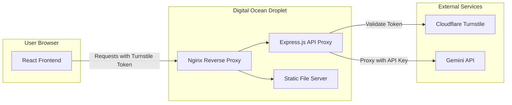

# Prompt Architect - Digital Ocean Deployment Plan

Deploy the Prompt Architect React application to a live Digital Ocean Droplet with invisible bot protection and secure API key management.

---

## Confirmed Configuration

| Decision | Choice | Notes |
|----------|--------|-------|
| **Captcha** | Cloudflare Turnstile (free tier) | Invisible, privacy-focused, no usage limits |
| **Droplet** | $6/mo Basic | Sufficient for this workload |
| **Deployment** | GitHub Actions auto-deploy | Push to `main` → auto-deploys |
| **Domain** | Flexible | Start with any domain; swap takes ~5 minutes |

> [!NOTE]
> **Domain Swapping is Easy**: When you get a new domain, you just (1) update DNS A record, (2) run `certbot --nginx -d new-domain.com`, and (3) update one line in Nginx config. Total time: ~15 minutes including DNS propagation.

> [!WARNING]
> **API Key Cost**: The Gemini API will be called through your backend proxy. Ensure you have appropriate billing/quota configured in Google AI Studio.

---

## Architecture Overview



**Key Security Architecture**:

| Concern | Solution |
|---------|----------|
| API Key Exposure | Backend proxy holds keys in environment variables; never sent to browser |
| Bot Abuse | Cloudflare Turnstile validates requests server-side before proxying |
| Transport Security | Nginx with SSL/TLS termination |
| Rate Limiting | Express rate-limiter middleware |

---

## Proposed Changes

### Project Restructuring

Transform the single-file React app into a production-ready fullstack structure.

---

#### [NEW] `package.json`

Root package.json for the project with scripts for development and production.

```json
{
  "name": "prompt-architect",
  "version": "1.0.0",
  "scripts": {
    "dev": "concurrently \"npm run dev:client\" \"npm run dev:server\"",
    "dev:client": "vite",
    "dev:server": "nodemon server/index.js",
    "build": "vite build",
    "start": "node server/index.js"
  }
}
```

---

#### [NEW] `client/` directory

Contains the React frontend built with Vite.

| File | Purpose |
|------|---------|
| `client/index.html` | Entry HTML file |
| `client/src/App.jsx` | Main React component (migrated from `initial-build.jsx`) |
| `client/src/main.jsx` | React entry point |
| `client/src/api.js` | API helper functions that call the backend proxy |

**Key Changes to `App.jsx`**:
- Remove direct Gemini API calls
- Add Turnstile widget integration (invisible mode)
- API calls route through `/api/generate` endpoint

---

#### [NEW] `server/` directory

Express.js backend that securely proxies API requests.

| File | Purpose |
|------|---------|
| `server/index.js` | Express server setup with middleware |
| `server/routes/api.js` | `/api/generate` endpoint that validates Turnstile and proxies to Gemini |
| `server/middleware/rateLimiter.js` | Rate limiting per IP |
| `server/middleware/turnstile.js` | Cloudflare Turnstile verification |

---

#### [NEW] `.env.example`

Template for environment variables (actual `.env` never committed).

```bash
# Gemini API Key (from Google AI Studio)
GEMINI_API_KEY=your_gemini_api_key_here

# Cloudflare Turnstile (from Cloudflare dashboard)
TURNSTILE_SECRET_KEY=your_turnstile_secret_key
TURNSTILE_SITE_KEY=your_turnstile_site_key

# Server Configuration
PORT=3001
NODE_ENV=production
```

---

#### [NEW] `.gitignore`

Ensure secrets and build artifacts are never committed.

```gitignore
node_modules/
dist/
.env
*.log
```

---

### Digital Ocean Droplet Configuration

---

#### [NEW] `deploy/setup.sh`

Automated server setup script for the droplet.

```bash
#!/bin/bash
# System updates, Node.js installation, Nginx setup, PM2 for process management
```

---

#### [NEW] `deploy/nginx.conf`

Nginx configuration for reverse proxy and SSL.

```nginx
server {
    listen 443 ssl http2;
    server_name your-domain.com;
    
    # SSL certificates (Let's Encrypt)
    # Proxy /api to Express backend
    # Serve static files for frontend
}
```

---

#### [NEW] `ecosystem.config.js`

PM2 configuration for production process management.

```javascript
module.exports = {
  apps: [{
    name: 'prompt-architect',
    script: 'server/index.js',
    env_production: {
      NODE_ENV: 'production'
    }
  }]
}
```

---

## Invisible Captcha Integration

### Cloudflare Turnstile (Recommended)

**Why Turnstile?**:
- Truly invisible - no user interaction required
- Privacy-focused (GDPR compliant)
- Free tier is generous for most use cases
- Simple server-side validation

**Frontend Integration** (in `App.jsx`):

```jsx
// 1. Load Turnstile script in index.html
// 2. Use invisible widget that auto-executes
<div id="cf-turnstile" 
     data-sitekey="YOUR_SITE_KEY" 
     data-callback="onTurnstileSuccess"
     data-appearance="interaction-only" />

// 3. Include token in API requests
const response = await fetch('/api/generate', {
  method: 'POST',
  body: JSON.stringify({
    prompt: userInput,
    turnstileToken: window.turnstileToken
  })
});
```

**Backend Validation** (in `server/middleware/turnstile.js`):

```javascript
// Validate token with Cloudflare before processing request
const secret = process.env.TURNSTILE_SECRET_KEY;
const verification = await fetch('https://challenges.cloudflare.com/turnstile/v0/siteverify', {
  method: 'POST',
  body: `secret=${secret}&response=${token}`
});
```

---

## Verification Plan

### Automated Tests

| Test | Command | Purpose |
|------|---------|---------|
| API Proxy Unit Tests | `npm run test:server` | Verify Turnstile middleware correctly validates/rejects tokens |
| Build Verification | `npm run build` | Ensure production build completes without errors |

---

### Manual Verification Checklist

> [!NOTE]
> These steps require the live droplet to be set up.

#### 1. API Key Security Check
1. Open browser DevTools → Network tab
2. Generate a prompt using the UI
3. **Verify**: No requests contain the Gemini API key in headers or URL
4. **Verify**: Requests go to `/api/generate`, not `generativelanguage.googleapis.com`

#### 2. Captcha Verification
1. Open browser DevTools → Console
2. Generate a prompt
3. **Verify**: Turnstile token is attached to the request payload
4. **Test**: Disable JavaScript and try submitting → should fail gracefully

#### 3. Rate Limiting Check
1. Use a tool like `ab` or `hey` to send 20 rapid requests
2. **Verify**: After threshold, requests receive `429 Too Many Requests`

#### 4. SSL/HTTPS Check
1. Visit the site via `http://` 
2. **Verify**: Automatically redirects to `https://`
3. Use [SSL Labs](https://www.ssllabs.com/ssltest/) to verify TLS configuration

---

## Deployment Steps (High-Level)

1. **Create Digital Ocean Droplet**
   - Ubuntu 22.04 LTS
   - Basic plan ($6/mo or higher)
   - Add SSH key for access

2. **Initial Server Setup**
   - Run `deploy/setup.sh` 
   - Configure firewall (UFW)
   - Install Node.js, Nginx, PM2

3. **Configure Cloudflare Turnstile**
   - Create site in Cloudflare dashboard
   - Get site key (frontend) and secret key (backend)

4. **Deploy Application**
   - Clone repository to server
   - Create `.env` with real credentials
   - Run `npm run build`
   - Start with PM2

5. **Configure Domain & SSL**
   - Point domain A record to droplet IP
   - Use Certbot for Let's Encrypt SSL

---

## GitHub Actions CI/CD

Automatic deployment on push to `main` branch.

---

#### [NEW] `.github/workflows/deploy.yml`

```yaml
name: Deploy to Digital Ocean

on:
  push:
    branches: [main]

jobs:
  deploy:
    runs-on: ubuntu-latest
    steps:
      - name: Deploy via SSH
        uses: appleboy/ssh-action@v1.0.0
        with:
          host: ${{ secrets.DROPLET_IP }}
          username: ${{ secrets.SSH_USER }}
          key: ${{ secrets.SSH_PRIVATE_KEY }}
          script: |
            cd /var/www/prompt-architect
            git pull origin main
            npm ci --production
            npm run build
            pm2 restart prompt-architect
```

**Required GitHub Secrets** (Settings → Secrets and variables → Actions):

| Secret | Description |
|--------|-------------|
| `DROPLET_IP` | Your Digital Ocean droplet's IP address |
| `SSH_USER` | Usually `root` or a deploy user |
| `SSH_PRIVATE_KEY` | Private SSH key for droplet access |

---

## Final Project Structure

```
prompt-architect/
├── .github/
│   └── workflows/
│       └── deploy.yml          # CI/CD pipeline
├── client/
│   ├── index.html              # Entry HTML with Turnstile script
│   ├── src/
│   │   ├── App.jsx             # Main React component
│   │   ├── api.js              # API helper (calls backend proxy)
│   │   └── main.jsx            # React entry point
│   └── vite.config.js          # Vite configuration
├── server/
│   ├── index.js                # Express server
│   ├── routes/
│   │   └── api.js              # /api/generate endpoint
│   └── middleware/
│       ├── rateLimiter.js      # Express rate limiting
│       └── turnstile.js        # Cloudflare token validation
├── deploy/
│   ├── setup.sh                # Server provisioning script
│   └── nginx.conf              # Nginx configuration
├── .env.example                # Environment variable template
├── .gitignore                  # Excludes .env, node_modules, dist
├── ecosystem.config.js         # PM2 process configuration
├── package.json                # Project dependencies and scripts
└── implementation-plan.md      # This file
```

---

## Implementation Order

| Step | Task | Estimated Time |
|------|------|----------------|
| 1 | Create project structure and migrate React code | 30 min |
| 2 | Build Express backend proxy with Turnstile | 20 min |
| 3 | Configure Cloudflare Turnstile (get keys) | 10 min |
| 4 | Create Digital Ocean Droplet & initial setup | 15 min |
| 5 | Deploy manually first time | 10 min |
| 6 | Set up GitHub Actions and test auto-deploy | 15 min |
| 7 | Configure domain + SSL | 10 min |

**Total estimated time: ~2 hours**

---

## Ready to Proceed?

Once you approve this plan, I'll begin with Step 1: scaffolding the project structure and migrating your React code to the new client/server architecture.
